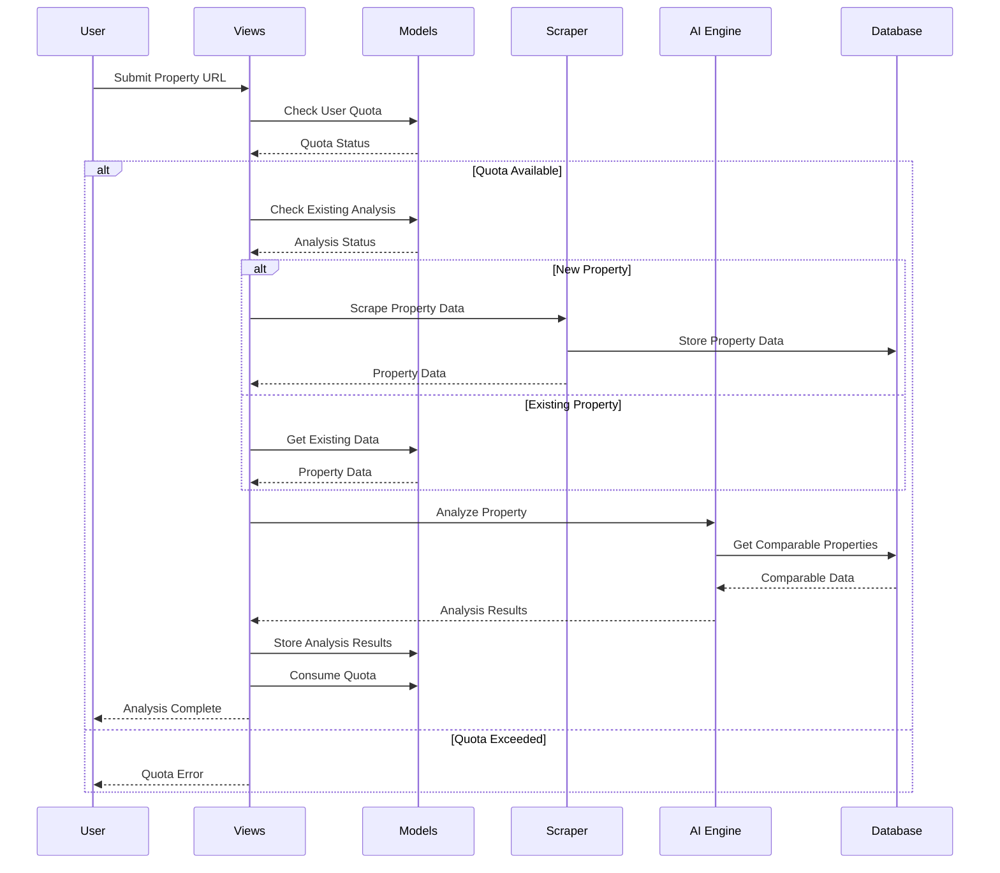
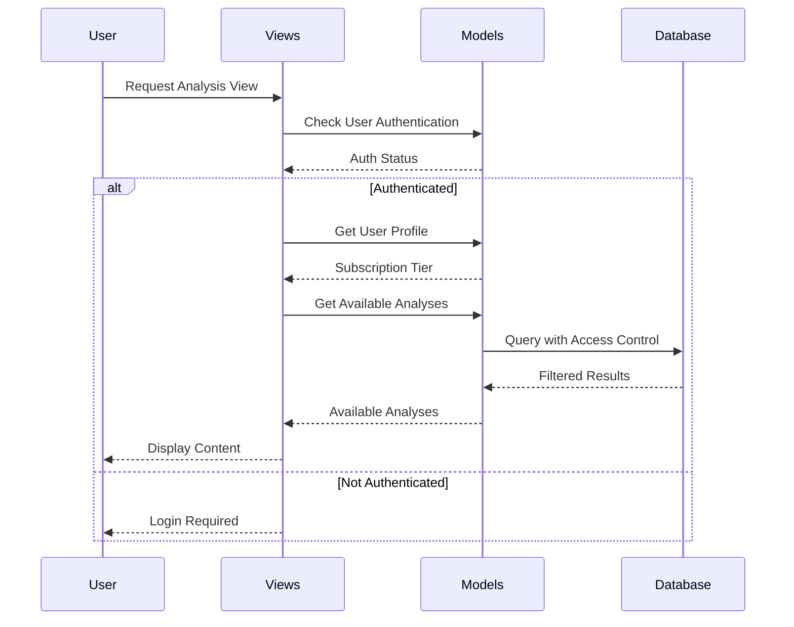

# Technical Architecture - Property AI System

## System Architecture Diagram

```
┌─────────────────────────────────────────────────────────────────────────────┐
│                                USER LAYER                                   │
├─────────────────────────────────────────────────────────────────────────────┤
│  Web Browser  │  Mobile App  │  API Client  │  Admin Interface             │
└─────────────────────────────────────────────────────────────────────────────┘
                                    │
                                    ▼
┌─────────────────────────────────────────────────────────────────────────────┐
│                              PRESENTATION LAYER                             │
├─────────────────────────────────────────────────────────────────────────────┤
│  Django Templates  │  Forms  │  Static Files  │  Media Files               │
│  • Base Template   │  • User │  • CSS/JS      │  • PDF Reports             │
│  • Analysis Views  │  • Prop │  • Images      │  • Uploads                 │
│  • Profile Views   │  • Auth │  • Icons       │                            │
└─────────────────────────────────────────────────────────────────────────────┘
                                    │
                                    ▼
┌─────────────────────────────────────────────────────────────────────────────┐
│                              APPLICATION LAYER                              │
├─────────────────────────────────────────────────────────────────────────────┤
│  Django Views & URLs                                                       │
│  ┌─────────────────┐  ┌─────────────────┐  ┌─────────────────┐            │
│  │  Analysis Views │  │   Home Views    │  │  Report Views   │            │
│  │  • analyze_prop │  │  • home         │  │  • download_rpt │            │
│  │  • my_analyses  │  │  • stats        │  │  • generate_rpt │            │
│  │  • analysis_det │  │  • featured     │  │                 │            │
│  └─────────────────┘  └─────────────────┘  └─────────────────┘            │
│  ┌─────────────────┐  ┌─────────────────┐  ┌─────────────────┐            │
│  │  Account Views  │  │  AI Engine      │  │  Scrapers       │            │
│  │  • register     │  │  • PropertyAI   │  │  • Century21    │            │
│  │  • login        │  │  • analyze_prop │  │  • scrape_prop  │            │
│  │  • profile      │  │  • generate_rpt │  │  • extract_data │            │
│  └─────────────────┘  └─────────────────┘  └─────────────────┘            │
└─────────────────────────────────────────────────────────────────────────────┘
                                    │
                                    ▼
┌─────────────────────────────────────────────────────────────────────────────┐
│                              BUSINESS LOGIC LAYER                           │
├─────────────────────────────────────────────────────────────────────────────┤
│  Django Models & Services                                                   │
│  ┌─────────────────┐  ┌─────────────────┐  ┌─────────────────┐            │
│  │  PropertyAnalysis│  │  UserProfile   │  │  ReportGenerator│            │
│  │  • Core Data    │  │  • Subscriptions│  │  • PDF Creation │            │
│  │  • Access Ctrl  │  │  • Quotas       │  │  • Templates    │            │
│  │  • Computed Props│  │  • Tier Mgmt   │  │  • Styling      │            │
│  └─────────────────┘  └─────────────────┘  └─────────────────┘            │
│  ┌─────────────────┐  ┌─────────────────┐  ┌─────────────────┐            │
│  │  Privacy Models │  │  Core Models    │  │  PageView Model │            │
│  │  • Consent      │  │  • TimeStamped  │  │  • Analytics    │            │
│  │  • Versions     │  │  • Encryption   │  │  • Tracking     │            │
│  │  • Audit Trail  │  │  • Base Classes │  │  • Metrics      │            │
│  └─────────────────┘  └─────────────────┘  └─────────────────┘            │
└─────────────────────────────────────────────────────────────────────────────┘
                                    │
                                    ▼
┌─────────────────────────────────────────────────────────────────────────────┐
│                              DATA ACCESS LAYER                              │
├─────────────────────────────────────────────────────────────────────────────┤
│  Django ORM & Database                                                      │
│  ┌─────────────────┐  ┌─────────────────┐  ┌─────────────────┐            │
│  │  PostgreSQL     │  │  Redis Cache    │  │  File Storage   │            │
│  │  • Main DB      │  │  • Sessions     │  │  • PDF Reports  │            │
│  │  • Analytics    │  │  • Cache        │  │  • Media Files  │            │
│  │  • User Data    │  │  • Queues       │  │  • Static Files │            │
│  └─────────────────┘  └─────────────────┘  └─────────────────┘            │
└─────────────────────────────────────────────────────────────────────────────┘
                                    │
                                    ▼
┌─────────────────────────────────────────────────────────────────────────────┐
│                              EXTERNAL SERVICES                               │
├─────────────────────────────────────────────────────────────────────────────┤
│  ┌─────────────────┐  ┌─────────────────┐  ┌─────────────────┐            │
│  │  Google Gemini  │  │  Century21      │  │  Email Service  │            │
│  │  • AI Analysis  │  │  • Property Data│  │  • Verification │            │
│  │  • JSON Output  │  │  • Web Scraping │  │  • Notifications│            │
│  │  • Timeout Prot │  │  • Data Extract │  │  • Marketing    │            │
│  └─────────────────┘  └─────────────────┘  └─────────────────┘            │
└─────────────────────────────────────────────────────────────────────────────┘
```

## Component Interaction Flow

### 1. Property Analysis Request Flow



### 2. User Access Control Flow



## Database Schema

### Core Tables

```sql
-- Property Analysis Table
CREATE TABLE property_ai_propertyanalysis (
    id UUID PRIMARY KEY,
    user_id INTEGER REFERENCES auth_user(id),
    scraped_by_id INTEGER REFERENCES auth_user(id),
    property_url VARCHAR(200) UNIQUE,
    property_title VARCHAR(500),
    property_location VARCHAR(255),
    neighborhood VARCHAR(100),
    asking_price DECIMAL(12,2),
    property_type VARCHAR(50),
    total_area INTEGER,
    internal_area INTEGER,
    bedrooms INTEGER,
    bathrooms DECIMAL(3,1),
    floor_level VARCHAR(50),
    property_condition VARCHAR(20),
    analysis_result JSONB,
    ai_summary TEXT,
    investment_score INTEGER,
    recommendation VARCHAR(20),
    status VARCHAR(20),
    agent_name VARCHAR(100),
    agent_email VARCHAR(254),
    agent_phone VARCHAR(20),
    created_at TIMESTAMP,
    updated_at TIMESTAMP,
    is_active BOOLEAN DEFAULT TRUE
);

-- User Profile Table
CREATE TABLE accounts_userprofile (
    id SERIAL PRIMARY KEY,
    user_id INTEGER REFERENCES auth_user(id) UNIQUE,
    subscription_tier VARCHAR(20) DEFAULT 'free',
    monthly_analyses_used INTEGER DEFAULT 0,
    monthly_quota_reset_date DATE,
    email_verification_token VARCHAR(64),
    is_email_verified BOOLEAN DEFAULT FALSE,
    created_at TIMESTAMP,
    updated_at TIMESTAMP
);

-- Privacy Policy Tables
CREATE TABLE accounts_privacy_policy_version (
    id SERIAL PRIMARY KEY,
    version VARCHAR(10) UNIQUE,
    content TEXT,
    effective_date DATE,
    is_active BOOLEAN DEFAULT TRUE,
    created_at TIMESTAMP
);

CREATE TABLE accounts_privacy_policy_consent (
    id SERIAL PRIMARY KEY,
    user_id INTEGER REFERENCES auth_user(id),
    policy_version_id INTEGER REFERENCES accounts_privacy_policy_version(id),
    accepted_at TIMESTAMP,
    ip_address INET,
    user_agent TEXT
);
```

### Indexes for Performance

```sql
-- Property Analysis Indexes
CREATE INDEX idx_property_url ON property_ai_propertyanalysis(property_url);
CREATE INDEX idx_property_location_type ON property_ai_propertyanalysis(property_location, property_type);
CREATE INDEX idx_asking_price ON property_ai_propertyanalysis(asking_price);
CREATE INDEX idx_investment_score ON property_ai_propertyanalysis(investment_score);
CREATE INDEX idx_status ON property_ai_propertyanalysis(status);
CREATE INDEX idx_scraped_by ON property_ai_propertyanalysis(scraped_by_id);
CREATE INDEX idx_agent_name ON property_ai_propertyanalysis(agent_name);
CREATE INDEX idx_created_at ON property_ai_propertyanalysis(created_at);

-- User Profile Indexes
CREATE INDEX idx_subscription_tier ON accounts_userprofile(subscription_tier);
CREATE INDEX idx_monthly_analyses ON accounts_userprofile(monthly_analyses_used);
CREATE INDEX idx_quota_reset ON accounts_userprofile(monthly_quota_reset_date);
```

## API Endpoints

### Analysis Endpoints

```
POST /property/analyze/
- Input: property_url
- Output: Analysis results or error
- Auth: Required
- Quota: Consumed

GET /property/my-analyses/
- Output: User's analysis history
- Auth: Required
- Quota: Not consumed

GET /property/analysis/<uuid>/
- Output: Detailed analysis view
- Auth: Required
- Access: Tier-based

GET /property/report/<uuid>/download/
- Output: PDF report file
- Auth: Required
- Access: Owner only
```

### User Management Endpoints

```
POST /accounts/register/
- Input: username, email, password
- Output: Registration success/error
- Auth: Not required

POST /accounts/login/
- Input: username, password
- Output: Login success/error
- Auth: Not required

GET /accounts/profile/
- Output: User profile and analyses
- Auth: Required

POST /accounts/profile/delete/
- Input: Confirmation
- Output: Deletion success/error
- Auth: Required
```

## Security Architecture

### Authentication & Authorization

```python
# Authentication Flow
1. User Registration → Email Verification → Login
2. Session Management → Redis-based sessions
3. Password Security → Django's built-in hashing

# Authorization Matrix
┌─────────────┬─────────┬─────────┬──────────┐
│ Resource    │ Free    │ Basic   │ Premium  │
├─────────────┼─────────┼─────────┼──────────┤
│ Own Analyses│   ✓     │   ✓     │    ✓     │
│ High Scores │   ✗     │   ✗     │    ✓     │
│ PDF Reports │   ✓     │   ✓     │    ✓     │
│ Quota       │   1/mo  │  10/mo  │ Unlimited│
└─────────────┴─────────┴─────────┴──────────┘
```

### Data Protection

```python
# GDPR Compliance
- Privacy Policy Version Tracking
- User Consent Records
- Data Deletion Capabilities
- Audit Logging

# Data Encryption
- Sensitive fields encrypted at rest
- HTTPS for all communications
- Secure file storage for reports
```

## Performance Optimization

### Caching Strategy

```python
# Redis Cache Layers
1. Session Storage
   - User sessions
   - Authentication tokens

2. Query Cache
   - Frequently accessed analyses
   - User profile data
   - Statistics and metrics

3. Template Cache
   - Rendered HTML fragments
   - Static content

# Cache Invalidation
- Analysis updates → Invalidate user cache
- Profile changes → Invalidate user cache
- New analyses → Update statistics cache
```

### Database Optimization

```python
# Query Optimization
1. Selective Field Loading
   - Only load required fields
   - Use select_related() for foreign keys
   - Use prefetch_related() for many-to-many

2. Pagination
   - Limit results per page
   - Use cursor-based pagination for large datasets

3. Index Strategy
   - Composite indexes for common queries
   - Partial indexes for filtered data
   - Covering indexes for frequently accessed data
```

## Error Handling & Monitoring

### Error Categories

```python
# Scraping Errors
- Network timeouts
- HTML parsing failures
- Rate limiting responses
- Invalid property URLs

# AI Analysis Errors
- API timeouts
- JSON parsing failures
- Invalid response formats
- Rate limiting

# User Input Errors
- Invalid URLs
- Quota exceeded
- Authentication failures
- Access denied
```

### Monitoring & Logging

```python
# Application Logging
- Structured logging with context
- Error tracking with stack traces
- Performance metrics
- User action audit trails

# External Service Monitoring
- Gemini API response times
- Century21 scraping success rates
- Email delivery status
- File storage operations
```

## Deployment Architecture

### Production Environment

```
┌─────────────────────────────────────────────────────────────────────────────┐
│                              LOAD BALANCER                                  │
│                              (Nginx/HAProxy)                               │
└─────────────────────────────────────────────────────────────────────────────┘
                                    │
                                    ▼
┌─────────────────────────────────────────────────────────────────────────────┐
│                              WEB SERVERS                                    │
│  ┌─────────────┐  ┌─────────────┐  ┌─────────────┐  ┌─────────────┐      │
│  │ Django App  │  │ Django App  │  │ Django App  │  │ Django App  │      │
│  │ (Instance 1)│  │ (Instance 2)│  │ (Instance 3)│  │ (Instance 4)│      │
│  └─────────────┘  └─────────────┘  └─────────────┘  └─────────────┘      │
└─────────────────────────────────────────────────────────────────────────────┘
                                    │
                                    ▼
┌─────────────────────────────────────────────────────────────────────────────┐
│                              DATA LAYER                                     │
│  ┌─────────────┐  ┌─────────────┐  ┌─────────────┐  ┌─────────────┐      │
│  │ PostgreSQL  │  │ Redis Cache │  │ File Storage│  │ CDN/Static  │      │
│  │ (Primary)   │  │ (Sessions)  │  │ (Reports)   │  │ (Assets)    │      │
│  └─────────────┘  └─────────────┘  └─────────────┘  └─────────────┘      │
│  ┌─────────────┐                                                           │
│  │ PostgreSQL  │                                                           │
│  │ (Replica)   │                                                           │
│  └─────────────┘                                                           │
└─────────────────────────────────────────────────────────────────────────────┘
```

### Scaling Considerations

```python
# Horizontal Scaling
- Multiple Django application instances
- Load balancer for traffic distribution
- Database read replicas
- Redis cluster for session management

# Vertical Scaling
- Increased server resources
- Database optimization
- Caching strategies
- CDN for static assets

# Background Processing
- Celery for async tasks
- Redis as message broker
- Worker processes for scraping
- Scheduled tasks for maintenance
```

This technical architecture provides a comprehensive view of how all components interact, scale, and maintain security and performance in the Property AI System.
